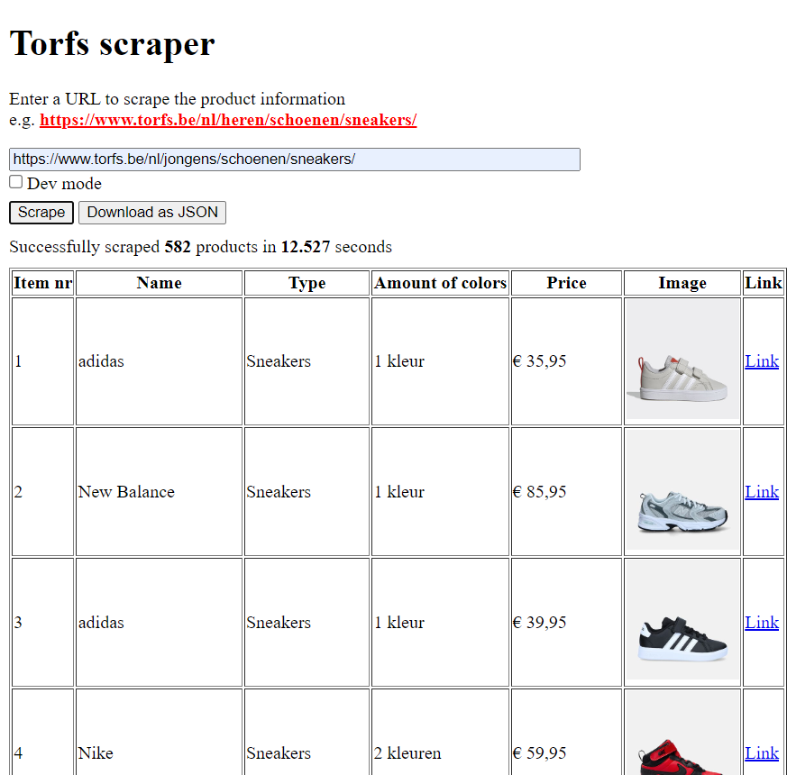

# expertlab-sprint2-scraping
This repository serves as a PoC of web scraping

## :computer: App: Torfs scraper
This app scrapes the website of Torfs with the webscraping tool [Puppeteer](https://pptr.dev/) for items. Users can choose which category they want to scrape by filling in the appropriate URL. For testing purposes, a development mode is available. When enabled, the user can choose how many pages they want to scrape instead of everything. This speeds up the process and is useful for testing.
<br><br>
The app displays all scraped items in a table containing the names, types, amount of colors, prices images and a link to the original item. The user can also download this data as a JSON-file.

<details>
<summary>Screenshots</summary>
<kbd></kbd><br><br>
Dev mode enabled<br>
<kbd></kbd><br><br>
JSON download<br>
<kbd></kbd>
</details>

## :wrench: Installation
### :bust_in_silhouette: Manual installation
1. Clone this repository
```bash
git clone https://github.com/SandroBarillaPXL/expertlab-sprint2-scraping
```
2. Install the dependencies
```bash
npm install
```	
3. Start the backend API-server, accessible at `http://localhost:3000`
```bash
node api.js
```
4. Start the frontend with a simple HTTP server of your choice, like the "live server" extension in Visual Studio Code for local use.

<br>

>:bulb: Note: Puppeteer requires a Chromium browser to be installed on your system. 

<br>

### :whale: Docker installation
1. Clone this repository
```bash
git clone https://github.com/SandroBarillaPXL/expertlab-sprint2-scraping
```
2. Build the Docker images (optional) for both the [frontend](./Dockerfile-fe) and [backend](./Dockerfile-be)
```bash
docker build -t <username>/<imagename-frontend>:<tag> -f Dockerfile-fe .
docker build -t <username>/<imagename-backend>:<tag> -f Dockerfile-be .
```
3. Run the Docker containers
```bash
docker run -d -p 3000:3000 <username>/<imagename-backend>:<tag>
docker run -d -p <port>:80 <username>/<imagename-frontend>:<tag>
```
<br>

Alternatively, you can use the [`docker-compose.yml`](./docker-compose.yml) file to run the containers. By default, the app is available at [`http://localhost:8500`](http://localhost:8500).
```bash
docker-compose up -d
```

## :information_source: Sources
* https://serpapi.com/blog/web-scraping-in-javascript-complete-tutorial-for-beginner/
* https://www.freecodecamp.org/news/web-scraping-in-javascript-with-puppeteer/
* https://javascript.plainenglish.io/scraping-for-images-using-puppeteer-9a3700bd5a2d/
* https://www.scrapingbee.com/blog/web-scraping-javascript/
* https://pptr.dev/
* https://pptr.dev/guides/docker/
* [ChatGPT conversation 1](https://chatgpt.com/share/6718de31-c400-8009-8553-fe0fa345833c)
* [ChatGPT conversation 2](https://chatgpt.com/share/6718fef5-8b2c-8009-ad24-afc78a75db24)