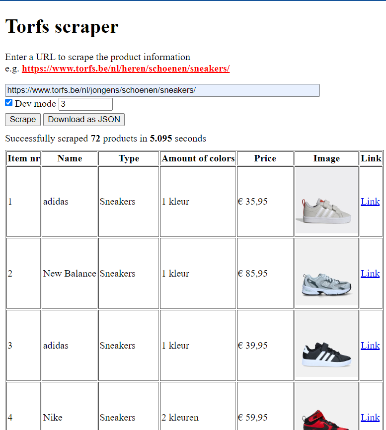

# expertlab-sprint2-scraping
This repository serves as a PoC of web scraping

## :computer: App: Torfs scraper
This app scrapes the website of Torfs and returns the name and price of the items. Users can choose which category they want to scrape by filling in the appropriate URL. For testing purposes, a development mode is available. When enabled, the user can choose how many pages they want to scrape instead of everything. This speeds up the process and is useful for testing.
<br><br>
The app displays all items in a table containing the names, types, amount of colors, prices and images of all scraped items.

<details>
<summary>Screenshots</summary>
<kbd></kbd><br><br>
Dev mode enabled<br>
<kbd></kbd>
</details>

## :wrench: Installation
### :bust_in_silhouette: Manual installation
1. Clone this repository
```bash
git clone https://github.com/SandroBarillaPXL/expertlab-sprint2-scraping
```
2. Install the dependencies
```bash
npm install
```	
3. Start the backend API-server, accessible at `http://localhost:3000`
```bash
node api.js
```
4. Start the frontend with a simple HTTP server of your choice, like the "live server" extension in Visual Studio Code for local use.
>:bulb: Note: Puppeteer requires a Chromium browser to be installed on your system. 
### :whale: Docker installation
1. Clone this repository
```bash
git clone https://github.com/SandroBarillaPXL/expertlab-sprint2-scraping
```
2. Build the Docker images (optional)
```bash
docker build -t <username>/<imagename-frontend>:<tag> -f Dockerfile-fe .
docker build -t <username>/<imagename-backend>:<tag> -f Dockerfile-be .
```
3. Run the Docker containers
```bash
docker run -d -p 3000:3000 <username>/<imagename-backend>:<tag>
docker run -d -p <port>:80 <username>/<imagename-frontend>:<tag>
```
<br>
Alternatively, you can use the `docker-compose.yml` file to run the containers
```bash
docker-compose up -d
```

## :information_source: Sources
* https://serpapi.com/blog/web-scraping-in-javascript-complete-tutorial-for-beginner/
* https://www.freecodecamp.org/news/web-scraping-in-javascript-with-puppeteer/
* https://javascript.plainenglish.io/scraping-for-images-using-puppeteer-9a3700bd5a2d/
* https://www.scrapingbee.com/blog/web-scraping-javascript/
* https://pptr.dev/
* https://pptr.dev/guides/docker/
* [ChatGPT conversation](https://chatgpt.com/share/6718de31-c400-8009-8553-fe0fa345833c)